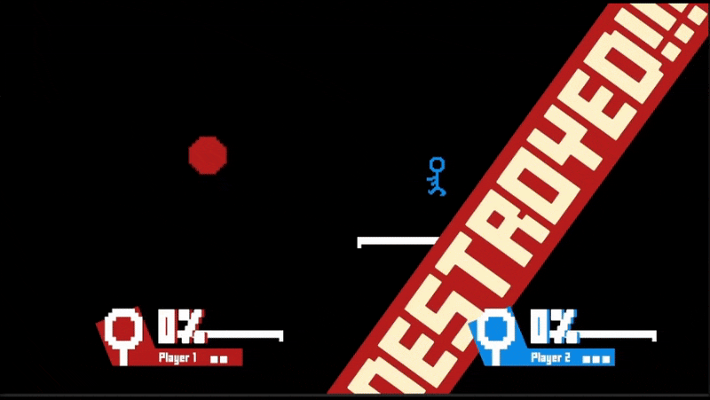

**This project is old. Check out our [most recent game](https://github.com/sugo14/CS-Club-Game-2) for the 2025-26 school year!**

This is the Unity game created by the Dr. Anne Anderson High School Coding Club in the 2024-25 school year.

It's a platform fighter drawing inspiration from many other games, primarily including Super Smash Bros. It's in extremely early stages of development.

We meet (almost) every Monday after school to work on our current game and discuss our progress. If you're interested, come by and say hi!

